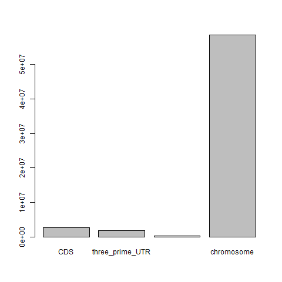
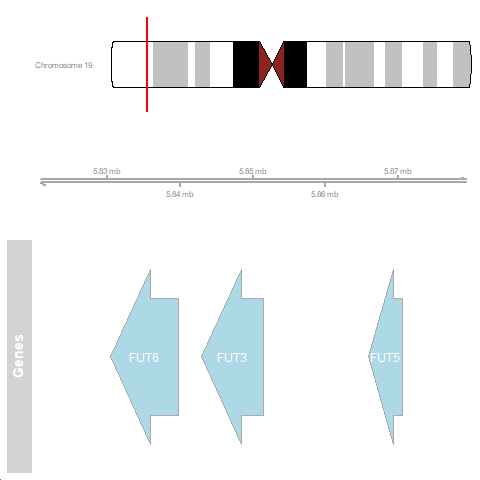
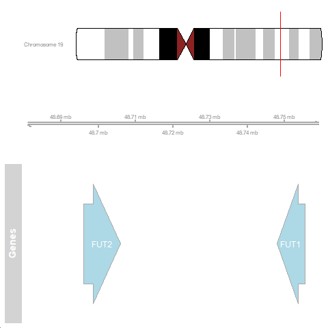

# Working with genome annotation files in R
**Author**: Wojciech Lason
**Contributor**: Helen Lockstone

Welcome! In this tutorial we will use the R programming environment to explore human gene annotations.
This tutorial has two main objectives:

* To demonstrate and practice some useful ways of handling data in R
* To get you familiar with gene annotation files

## Getting started

First create a new folder on your computer to work in and then open RStudio. We need to tell R where this is:
* from the top menu bar, select 'Session' 
* select 'Set Working Directory'
* 'Choose Directory'
* navigate through your file system to the new directory folder
* click 'Open'


In this tutorial, we will use a file obtained from [Ensembl](https://ftp.ensembl.org/pub/current_gff3/homo_sapiens/) containing annotations for (human) genes on chromosome 19. This subset of genome annotations will be used to illustrate the file content, organisation and perform some typical tasks.


``` 
download.file(url = 'http://ftp.ensembl.org/pub/release-107/gff3/homo_sapiens/Homo_sapiens.GRCh38.107.chromosome.19.gff3.gz', destfile = 'Homo_sapiens.GRCh38.107.chromosome.19.gff3.gz')
```
 
:::note Note
Gene annotation files contain information about gene structure (exons, transcripts, coding sequence etc.), identifiers, position in the genome and other details. There are different sources and varieties of gene annotations and a standard file format exists to store them; this is known as GFF3 (General Feature Format v3) or the older GTF (Gene Transfer Format).
See these pages for more information about gff files from [Ensembl](https://www.ensembl.org/info/website/upload/gff3.html) and [NCBI](https://www.ncbi.nlm.nih.gov/genbank/genomes_gff/)

GRCh38 refers to the name of the genome assembly - this is the latest 'major release' of the human genome from the Genome Reference Consortium (GRC), with 107 referring to the 'minor release' version.
:::


The main content of the file is some tab-delimited text split into 9 columns, each row corresponding to an annotation entry. These rows start after several 'header' rows with general information about the file; header rows start with a # symbol and are just one column. 

| Column                             | Description                                                                    |
| :--------------------------------- | :------------------------------------------------------------------------------|
| Sequence name (`seqid`)            | Name of the chromosome or scaffold. Watch out for differences between annotation consortia - e.g. chromosome 1 could be denoted as 'chr1' or just '1'                         					          |
| Source (`source`)                  | Annotation source. Includes 'ensembl' - automatic annotation program and 'havana' - manual annotation by HAVANA group                                                  								     |
| Feature type (`type`) 		     | Region type. Examples include coding sequence (CDS), exon (exon), 3' UTR (three_prime_UTR), 5' UTR (five_prime_UTR)									          |
| Start (`start`)                    | Genomic coordinate where the annotated sequence starts						  |
| End (`end`)                        | Genomic coordinate where the annotated sequence ends 						  |  
| Score (`score`)                    | A numeric value normally referring to the confidence score of the annotated sequence |
| Strand (`strand`)                  | Direction of the sequence in double-stranded DNA. Can be either '+' (forward/sense strand) or '-' (reverse/antisense strand)            								                                    |
| ORF (`phase`)                      | Refers to the start of the open reading frame (ORF). Can be 0, 1, or 2 - 0 indicates that the first base of the feature is the first base of a codon  										              |
| Attributes (`attributes`)          | A list of name-value pairs separated by semicolons, in the format 'name=value'. Attributes differ in type and number based on the feature type and the annotation program 							 |


:::note Note
If you want to practice your command line skills, you can try using the `curl`, `gunzip` and `less` commands  to get the file and inspect the contents.

:::


## Reading the gene annotation file into R
In R, we can use the standard function `read.delim()`, which reads any delimited file (fields separated by tab, comma, etc.), to read the gene annotation file into memory and examine it. As the GFF does not include column names, we will specify `header = F` and tell R to ignore all the lines that start with '\#' using the argument `comment.char` - these happen to be default parameters of function `read.delim()`, but it is good practice to be explicit about the function arguments in your code. We will give the columns meaningful names.


```
gff <- read.delim('Homo_sapiens.GRCh38.107.chromosome.19.gff3.gz', comment.char = '#', header = FALSE, col.names = c('seqid', 'source', 'type', 'start', 'end', 'score', 'strand', 'phase', 'attributes'))

# R automatically stores the data in a 2-dimensional object called a `data.frame`. We can check the dimensions of the object first:
dim(gff)

# inspect the first 6 rows and columns 1-8 (`head` displays the first 6 rows by default)
head(gff[,1:8])
  seqid source       type start      end score strand phase
1    19 GRCh38 chromosome     1 58617616     .      .     .
2    19 havana pseudogene 60951    71626     .      -     .
3    19 havana    lnc_RNA 60951    70976     .      -     .
4    19 havana       exon 60951    61894     .      -     .
5    19 havana       exon 66346    66499     .      -     .
6    19 havana       exon 70928    70976     .      -     .
```

As you can see, the first 8 columns are compact and readily readable. (A dot in any column '.' indicates no value for that particular feature). The 9th column 'attributes' poses more difficulty - it contains multiple fields separated by the ';' character, and different rows can contain different information depending on the type of feature being described. Let's take a look at it:
```
head(gff[,9])
[1] "ID=chromosome:19;Alias=CM000681.2,chr19,NC_000019.10"                                                                                                                                                                               
[2] "ID=gene:ENSG00000282458;Name=WASH5P;biotype=transcribed_processed_pseudogene;description=WASP family homolog 5%2C pseudogene [Source:HGNC Symbol%3BAcc:HGNC:33884];gene_id=ENSG00000282458;logic_name=havana_homo_sapiens;version=1"
[3] "ID=transcript:ENST00000632506;Parent=gene:ENSG00000282458;Name=WASH5P-206;biotype=processed_transcript;tag=basic;transcript_id=ENST00000632506;transcript_support_level=1;version=1"                                                
[4] "Parent=transcript:ENST00000632506;Name=ENSE00003783010;constitutive=0;ensembl_end_phase=-1;ensembl_phase=-1;exon_id=ENSE00003783010;rank=3;version=1"                                                                               
[5] "Parent=transcript:ENST00000632506;Name=ENSE00003783498;constitutive=0;ensembl_end_phase=-1;ensembl_phase=-1;exon_id=ENSE00003783498;rank=2;version=1"                                                                               
[6] "Parent=transcript:ENST00000632506;Name=ENSE00003781173;constitutive=0;ensembl_end_phase=-1;ensembl_phase=-1;exon_id=ENSE00003781173;rank=1;version=1"                                 
```


There is some underlying organisation to this column for the file to conform to GFF3 format, but it is not readily apparent. However, take a closer look at this column and see if you can see any structure to the information that is stored there. 

R helpfully determines automatically how best to store any data read in from a file. Data frame objects can have different types of data in their different columns and we can check how R has handled our file: 


```
class(gff) # data.frame
# looking at columns 1, 2 and 9 in turn
class(gff[,1]) # integer
class(gff[,2]) # character
class(gff[,9]) # character

# looking at 2 particular elements of the data frame
class(gff[1,1]) # integer
class(gff[1,2]) # character
```
The assigned data type or class will apply to the whole column. Text-based data is stored as a string of characters in R's memory, so column 9 is just a very long string of characters. 

```
nchar(gff[2,9]) # this tells us that column 9 of row 2 has 227 characters
```

To make the data in 'attributes' (column 9) more accessible, we could write a function that splits the long string based on the ';' character, then split the resulting strings based on '=' character. This would generate substrings of different fields, and then their respective values. But it is still complicated because there are a lot of fields in column 9 and they are simply omitted if there is no value/not applicable for a given feature (row). 

As an example, inspecting the second row with `gff[2,9]` would give us 6 field names: "ID", "Name", "description", "gene_id", "logic_name", "version"
Inspecting another row (the 10th) with `gff[10,9]` shows us it has some different fields: "Parent", "Name", "constitutive", "ensembl_end_phase", "ensembl_phase", "exon_id", "rank", "version"

Usefully, there is an R/Bioconductor package that can deal with this for us called `rtracklayer`. https://bioconductor.org/packages/release/bioc/html/rtracklayer.html [Bioconductor](https://www.bioconductor.org/) is a open-source project developing software for Bioinformatics. If you are working with genomic data, chances are there is an existing Bioconductor package that will perform common processing and analysis tasks. 

We need to download and install the package to have access to its functionality:

```
if (!require("BiocManager", quietly = TRUE))
    install.packages("BiocManager")
install.packages("rtracklayer")
```
and then load the library in the current R session:

```
library(rtracklayer)
```

Now we can use `readGFF` to handle reading the gff file into R. `readGFF` is a bespoke function defined within the `rtracklayer` package to read any GFF3 file into R, dealing with column 9 by separating the information into many columns. Looking at the output will show there are now 28 columns compared to 9 before. 
```
gff <- readGFF('Homo_sapiens.GRCh38.107.chromosome.19.gff3.gz')
gff <- as.data.frame(gff)
head(gff)
dim(gff)
```

:::note Note
If you forget to load the library, R will give an error, saying it doesn't recognise the function `readGFF` - this just means it is not available in what is known 'base' R i.e. the standard functionality. 
:::

OK, this is much better now! Every field in the original 'attributes' column has its own column, and there is an 'NA' value if the information for that row is missing.
Let's see what the file contains.

```
colnames(gff)

## columns can be referred to in several ways
## the following commands all extract the first 6 elements of the 3rd column
head(gff[,3])
head(gff[,"type"])
head(gff$type)

## summarising the contents of the whole column
table(gff$type)

```

:::tip Helpful tip 
`table` is an extremely useful R function, producing counts for the set of unique entries in a given column. This can help both to quickly summarise the data and spot any typos or inconsistencies in your input file - for example perhaps gender information was recorded as 'M' or 'm' in different parts of the file - in a very large file, this might be hard to spot by eye and cause some problems further down the line with your analysis. 
:::

## Looking at the contents of the gene annotation file
Now we will try to find out some things about the genes on chromosome 19. 

First, extract the details about chromosome 19 (note it is the first feature in the gff file). We'll store this in a new variable to 'save' it and be able to access it later.
chr19 <- gff[1,]

Now, let's subset the GFF file so that it contains entries described as *ensembl_havana* in column 2 (source)
Recall that subsetting in R is possible using square brackets `[ ]` or the function `subset()`.

```
gff <- subset(gff, source == 'ensembl_havana')
dim(gff)
```

Our `gff` object now has 38293 rows. The *ensembl_havana* set of annotations combine computationally predicted genes with manually-curated annotations from the HAVANA group. You can read more about those on the [Ensembl website](https://www.ensembl.org/info/genome/genebuild/annotation_merge.html).


Note that we have over-written the previous `gff` object containing all rows from the original file because we gave it the same name just now! Within the ensembl_havana annotations are still several different entry types, which can be summarised with `table(gff$type)`

Inspect the number of each type and consider if they make sense. We can see there are 1343 gene features. 

::: note Note
In R, there are always several ways to do something. We could alternatively find the number of entries matching "gene" in column 2 as follows:

```
# using the which command
length(which(gff$type=="gene"))

# or by 
sum(gff$type == "gene")
```

A bit more about what the 2 commands above are doing:
`which` returns the row numbers for which the specified condition is true - in this case that column 3 (type) contains the string "gene". 
Note that this is case-sensitive: `length(which(gff$type=="Gene"))` returns 0!

`gff\$type == 'gene'` will return a boolean (TRUE/FALSE) value for every row in the dataframe. You can see this with the `head` command:

```
head(gff$type == "gene")
```

What will the length of this output be? You can check with `length(gff$type == "gene")`

To count the number of 'TRUE' values, we use the property that TRUE is equal to 1 and FALSE is equal to 0. Therefore, sum of TRUE occurences is the number of rows that correspond to gene entries in our GFF file
:::


Now let's take a closer look at these 1343 genes on chromosome 19. 

```
genes <- gff[gff$type == "gene", ]  #Subset the data frame, keeping all columns

nrow(genes) # 1343, as we found above
```

It would be interesting to see what proportion of genes lie on each strand of the DNA, denoted as + (sense) and - (antisense) in the gff file. We can produce count summaries using the fuction `table()`.

```
table(genes$strand)
#   -   + 
# 665 678 
```

We can see that the proportion of genes on either strand is approximately equal. What about exon coverage? Let's calculate the proportion of chromosome 19 that encodes exons.

```
exons <- gff[gff$type=="exon", ]
dim(exons)
head(exons)

exon.lengths <- (exons$end - exons$start) + 1 # adding 1 because of the 1-based coordinate system (start and end positions inclusive)
chr19.length <- chr19$end + 1

(sum(exon.lengths)) / chr19.length
# 0.0804416
```

This suggests around 8% of chromosome 19 is annotated as exons for the set of genes classifed as *ensembl_havana*
Can you carry out a similar calculation to see how much of chromosome 19 codes for protein?

:::note Challenge Question
Think about the exonic calculation and result above. Will it over- or under-estimate exon coverage? Why? 
How could you refine the answer? 
:::

## Plotting data
Now let's make a few plots of the gene annotation data

```r
regions <- gff[gff$type%in% c('CDS', 'three_prime_UTR', 'five_prime_UTR'), ]
regions$length <- (regions$end - regions$start) + 1

region_lengths <- data.frame()      #Create an empty data frame object to store the results
for (type in c('CDS', 'three_prime_UTR', 'five_prime_UTR')){
  region_lengths[type, 'length'] <- sum(regions[regions$type == type, 'length']) # calculate sum of lengths for each region type
}

barplot(region_lengths$length, names.arg = rownames(region_lengths))
```


Can you hypothesise why the 3' UTR sequences are, on average, longer than 5'?

We saw before that the exonic regions are only a small fraction of the chromsome sequence. To visualise this, let's now add the length of the entire chromosome 19 for scale!

```r
region_lengths['chromosome', 'length'] <- chr19.length

barplot(region_lengths$length, names.arg = rownames(region_lengths))
```



## FUT genes
Let's look at some interesting genes on chromosome 19. We will look at a class of enzymes called fucosyltarnsferases, which are involved in chemical modification of glycans displayed on the cell surface. There are 13 of them in the entire genome, let's see how many on chromosome 19 - their symbols all start with 'FUT'.


```r
# find all the gene names that contain 'FUT'
FUT.genes <- grep(pattern = 'FUT', gff$Name, value = TRUE) 
FUT.genes

#[1] "FUT6"     "FUT6-202" "FUT6-201"
#[4] "FUT3"     "FUT3-201" "FUT3-202"
#[7] "FUT5"     "FUT2"     "FUT2-202"
#[10] "FUT1"     "FUT1-206"
```

This is interesting - there are some gene symbols as well as some with a dash and a number. Let's take a closer look at their annotations.


```r
subset(gff, Name %in% FUT.genes)[,9:12]
                              ID Alias     Name        biotype
# 23031        gene:ENSG00000156413           FUT6 protein_coding
# 23032  transcript:ENST00000318336       FUT6-202 protein_coding
# 23061  transcript:ENST00000286955       FUT6-201 protein_coding
# 23117        gene:ENSG00000171124           FUT3 protein_coding
# 23118  transcript:ENST00000303225       FUT3-201 protein_coding
# 23136  transcript:ENST00000458379       FUT3-202 protein_coding
# 23198        gene:ENSG00000130383           FUT5 protein_coding
# 147878       gene:ENSG00000176920           FUT2 protein_coding
# 147886 transcript:ENST00000425340       FUT2-202 protein_coding
# 148150       gene:ENSG00000174951           FUT1 protein_coding
# 148151 transcript:ENST00000645652       FUT1-206 protein_coding
```


Bingo! Some annotations are for the genes (ENSG identifiers) and the others correspond to mRNA transcripts (those with the dashes and identifiers beginning with "ENST"). We are only interested in the genes, so let's modify our search to reflect that.

```r
FUT.genes <- grep('\\-', FUT.genes, value = TRUE, invert = TRUE) 
# \\ is an escape character, which tells grep to look for an actual dash, not a dash symbol with a special meaning.
# `invert` tells grep to exclude genes containing a dash.

## inspect the new set of matching results
FUT.genes
# [1] "FUT6" "FUT3" "FUT5" "FUT2" "FUT1"

## store them in a new object
FUT.genes_df <- subset(gff, Name %in% FUT.genes)
FUT.genes_df
```


Let's visualise the relative placement of all the FUT genes using a genome browser. We will use GenomicRanges object, which is a compact way of storing sequence information. We will then use Gviz package to create 'tracks' (in our case, the reference track will be empty, but it can contain information about the genome).
Install the packages (if not already downloaded)
```
BiocManager::install("GenomicRanges")
BiocManager::install("Gviz")
BiocManager::install("GenomicFeatures")
```

Load the libraries
```
library(GenomicRanges)
library(Gviz)
library(GenomicFeatures)
```

First we prepare the plot (don't worry too much about this code snippet)
```
FUT.genes_gr <- with(FUT.genes_df, GRanges(seqid, IRanges(start, end), strand, id = Name))
 
chr_track <- IdeogramTrack(genome = 'hg38', chromosome = 'chr19') # This creates a chromosome 'ideogram', or a graphic, with cytological bands, based on corresponding data from UCSC (another genome resource like Ensembl)
ref_track <- GenomeAxisTrack() # This creates an empty track where our genes will be displayed
data_track <- AnnotationTrack(FUT.genes_gr, name = "Genes", showFeatureId = TRUE) # This creates the annotations to display
```

When inspecting the data frame `FUT.genes_df[,1:10]`, you can see that there are two clusters of fucosyltransferase genes - one cluster of 3 genes in the 5.8Mb region and another 2 genes in the 48.7Mb region. We will plot these two regions separately as they are far apart.


```r
#Cluster 1
plotTracks(c(chr_track, ref_track, data_track),
           from = 5.82e6, to = 5.88e6, sizes = c(1,1,2))
```



```r
#Cluster 2
plotTracks(c(chr_track, ref_track, data_track),
           from = 48.68e6, to = 48.76e6, sizes = c(1,1,2))
```



Feel free to change the `from` and `to` values to zoom in and out of the loci. You can also produce some code that will automatically establish the optimal region to show using functions `min()`, `max()`, and the arguments `extend.right`/`extend.left` of the function `plotTracks`. The arrows indicate transcript directionality (remember '+' and '-' strands from our GFF? They correspond to right- and left-pointing arrows, respectively).

And that's the end of this tutorial! Now you know how to read in and handle data in R, learned a bit more about gene annotation files and ways to visualise some of the information they contain.

