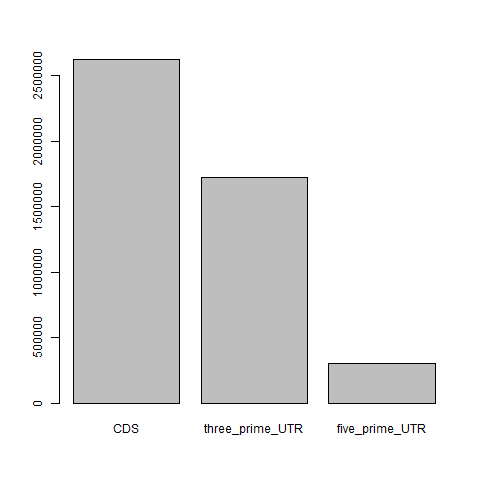
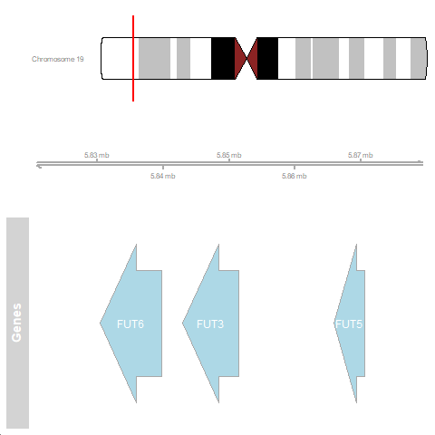
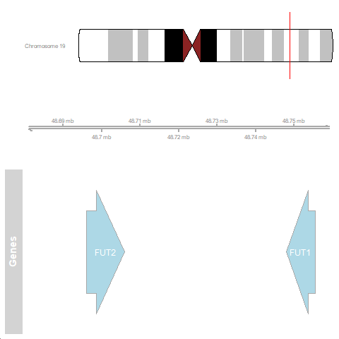

# Working with genome annotation files in R
**Author**: Wojciech Lason
**Additions**: Helen Lockstone

Welcome! In this tutorial we will use the R programming environment to explore human gene annotations.
This tutorial has two main objectives:

* To demonstrate some useful ways of working with data files in R
* And to get you to start understanding gene annotation data - that is, the core data files which represent our knowledge of human genes.


Gene annotation files contain information about gene structure (exons, transcripts), identifiers, position in the genome and other defined information; they can be stored in GFF3 or GTF format


 In this tutorial, we will use a file containing annotations for (human) genes on chromosome 19 (this reduces the size of the file considerably and is sufficient to illustrate the content, organisation and perform some typical tasks)

 The file 'Homo_sapiens.GRCh38.107.chromosome.19.gff3' is a tab-delimited text file with 9 columns for each line. These start after several 'header' rows with general information about the file, which start with a # symbol. 
 
 :::note Note
 
 GRCh38 refers to the name of the genome assembly - this is the latest 'major release' of the human genome from the Genome Reference Consortium (GRC), with 107 referring to the version of minor updates or 'minor release'.
 
 :::
 
``` 
download.file(url = 'http://ftp.ensembl.org/pub/release-107/gff3/homo_sapiens/Homo_sapiens.GRCh38.107.chromosome.19.gff3.gz', destfile = 'Homo_sapiens.GRCh38.107.chromosome.19.gff3.gz')
```

## needs unzipping


As you can see, there are a few header lines that start with a '\#' specifying some details of the file and the genome build. Next, there is some tab-delimited text split into 9 columns. These are (based on [Ensembl website](https://www.ensembl.org/info/website/upload/gff.html)):

| Column                             | Description                                                                                                                                                                |
|----------------|:-------------------------------------------------------|
| Sequence name (`seqname`)          | Name of the chromosome or scaffold. Watch out for differences between annotation consortia. Chromosome 1 could be denoted as 'chr1' or just '1'.                           |
| Source (`source`)                  | Annotation source. Includes 'ensembl' - automatic annotation program and 'havana' - manual annotation by HAVANA group.                                                     |
| Feature type (`feature` or `type`) | Region type. Can be coding sequence (CDS), exon (exon), 3' UTR (three_prime_UTR), 5' UTR (five_prime_UTR), and more, depending on the annotation source.                   |
| Start (`start`)                    | Genomic coordinate where the annotated sequence starts.                                                                                                                    |
| End (`end`)                        | Genomic coordinate where the annotated sequence ends.                                                                                                                      |
| Score (`score`)                    | A numeric value normally referring to the confidence score of the annotated sequence.                                                                                      |
| Strand (`strand`)                  | Direction of the sequence in double-stranded DNA. Can be either '+' (forward/sense strand) or '-' (reverse/antisense strand).                                              |
| ORF (`frame`)                      | Refers to the start of the open reading frame (ORF). Can be '0', '1', or '2' - '0' indicates that the first base of the feature is the first base of a codon.              |
| Attributes (`attribute`)           | A list of name-value pairs separated by semicolons, in the format 'name=value'. Attributes differ in type and number based on the feature type and the annotation program. |

A dot in any column '.' indicates no value.

Let's try base R function `read.delim()`, which reads any delimited file (tab, comma, etc.), to read the GFF into memory and examine it. As the GFF does not include column names, we will specify `header = F` and tell R to ignore all the lines that start with '\#' using the argument `comment.char` - these happen to be default parameters of function `read.delim()`, but it is good practice to be explicit about the function arguments in your code. We will give the columns meaningful names.


```
gff <- read.delim('Homo_sapiens.GRCh38.107.chromosome.19.gff3', comment.char = '#', header = FALSE, col.names = c('seqname', 'source', 'type', 'start', 'end', 'score', 'strand', 'frame', 'attribute'))

# R automatically stores the data in a 2-dimensional object called a `data.frame`
# Check the dimensions of the object:
dim(gff)

# inspect the first 6 rows and columns 1-8 (`head` displays the first 6 rows by default)
head(gff[,1:8])

```

As you can see, the first 8 columns are compact and readily readable, but the 9th column 'attribute' poses a challenge. It contains multiple fields separated by the ';' character, and different rows can contain different information depending on the type of feature being described. Let's take a look at it:
```
head(gff[,9])
```


There is some underlying organisation to this column for the file to conform to GFF3 format, but it is not readily apparent just by looking at it. 
However, take a closer look at this column and see if you can see any structure to the information that is stored there. 

R very helpfully automatically determines how best to store any data read in from a file. Data frame objects can have different types of data in different columns and we can check how R has handled our file: 


```
class(gff) # data.frame
# looking at columns 1, 2 and 9 in turn
class(gff[,1]) # integer
class(gff[,2]) # character
class(gff[,9]) # character

# looking at a particular element of the data frame
class(gff[1,1]) # integer
class(gff[1,2]) # character

```
The assigned data type or class will apply to the whole column. 

Text-based data is stored as a string of characters in R's memory, so column 9 is just a very long string of characters. 

```
nchar(gff[1,9])
```


To make the data in 'attribute' (column 9) more accessible, we could write a function that splits the long string based on the ';' character, then split the resulting strings based on '=' character. This would generate substrings of different fields, and then their respective values. But it is still complicated because there are a large number of fields in column 9 and they are simply missed out if no value for a given feature (row). 

As an example, inspecting `gff[2,9]` would give us 6 field names: "ID", "Name", "description", "gene_id", "logic_name", "version"
Inspecting another row `gff[10,9]` shows us "Parent", "Name", "constitutive", "ensembl_end_phase", "ensembl_phase", "exon_id", "rank", "version"

Usefully, there is an R/Bioconductor package that can deal with this for us called `rtracklayer`.
https://bioconductor.org/packages/release/bioc/html/rtracklayer.html

You can read more about the Bioconductor project here - open source software for Bioinformatics. If you are working with genomic data, chances are there is an existing Bioconductor package that will perform common processing and analysis tasks. 

We need to download and install the package to have access to its functionality:

```
if (!require("BiocManager", quietly = TRUE))
    install.packages("BiocManager")
install.packages("rtracklayer")
```

and then load the library in the current R session

```
library(rtracklayer)

gff <- readGFF('Homo_sapiens.GRCh38.107.chromosome.19.gff3')
gff <- as.data.frame(gff)
head(gff)
dim(gff)
```

`readGFF` is a bespoke function defined only within the `rtracklayer` package to read any GFF3 file into R, dealing with column 9 by separating the information into many columns. Looking at the output above will show there are now 28 columns compared to 9 before. 

:::note Note

If you forget to load the library, R will give an error, saying it doesn't recognise the function `readGFF` - this just means it is not available in what is known base R - the standard functionality. 

:::

OK, this is much better! Every field in the original 'attribute' column now has its own column, and there is an 'NA' value if the information for that row is missing.

```
colnames(gff)

table(gff[,2])

## columns can also be referred to by name with a preceding $ sign
table(gff$source)

table(gff$type)

```

`table` is an extremely useful R function, producing counts for the set of unique entries in a given column - this can help both to quickly summarise the data and spot any typos or inconsistencies in your input file - for example perhaps gender information was recorded as 'M' or 'm' in different parts of the file - in a very large file, this might be hard to spot by eye. 

Now we will try to find out some things about the genes on chromosome 19. 


First, let's save the length of chromosome 19 (first row of the data frame) which will become useful later and subset the GFF file so that it contains entries of type "ensembl_havana" - these are bioinformatics-predicted annotations generated by Ensembl merged with manual annotations by HAVANA group. You can read more about those on the [Ensembl website](https://www.ensembl.org/info/genome/genebuild/annotation_merge.html).

Recall that subsetting in R is possible using square brackets `[ ]` or the function `subset()`.


```r
chr19 <- gff[1, ]
gff <- subset(gff, source == 'ensembl_havana')
dim(gff)
```

Our data object is now reduced to 38,293 rows. Note that we have over-written the previous `gff` object containing all rows from the original file because we gave it the same name just now. 

Within these annotations are still a several different entry types, which can be summarised with `table(gff$type)`

Inspect the number of each type and consider if they make sense. 

From the output we can see there are 1343 genes. There are several other ways to find this out: 

```
# using the `which` command
length(which(gff$type=="gene"))
# alternatively
sum(gff$type == "gene")
```

More about what the 2 commands above are doing

`which` returns the row numbers for which the specified condition is true, in this case that column 3 (type) contains the string 'gene'. 
Note that this is case-sensitive; `length(which(gff$type=="Gene"))` returns 0!


The gff\$type == 'gene' will return a boolean (TRUE/FALSE) value for every row in the dataframe. You can see this with the `head` command:
```
head(gff$type == "gene")

Q. what will the length of this output be? Check with:
`length(gff$type == "gene")`

To count the number of 'TRUE' values, we will use the property that TRUE is equal to 1 and FALSE is equal to 0. Therefore, sum of TRUE occurences is the number of rows that correspond to gene entries in our GFF file


Now let's take a closer look at these 1343 genes on chromosome 19. 

```
genes <- gff[gff$type == "gene", ]  #Subset the data frame, keeping all columns

nrow(genes) # 1343, equal to what we calculated above
```

It would be interesting to see what proportion of genes lie on each strand of the DNA, denoted as + (sense) and - (antisense) in the gff file. We can produce count summaries using the fuction `table()`.


```
table(genes$strand)
```

```
## 
##   -   + 
## 665 678
```

We can see that the proportion of genes on either strand is approximately equal.

What about genome coverage? How much of the genome is actually used to encode information about genes? Let's calculate the proportion of DNA occupied by coding sequences in relation to the chromosome length.


## check this calculation and code
```
cds <- gff[gff$type == 'CDS', ]
cds$length <- cds$end - cds$start

sum(cds$length) / (chr19$end - chr19$start)
```

```
## [1] 0.04460002
```

Can you carry out a similar calculation to see how much of the genome is covered by exons?


```r
regions <- gff[gff$type%in% c('CDS', 'three_prime_UTR', 'five_prime_UTR'), ]
regions$length <- regions$end - regions$start

region_lengths <- data.frame()      #Create a data frame object to store the results
for (type in c('CDS', 'three_prime_UTR', 'five_prime_UTR')){
  region_lengths[type, 'length'] <- sum(regions[regions$type == type, 'length'])    #Calculate sum of lengths for each region
}

barplot(region_lengths$length, names.arg = rownames(region_lengths))
```



Can you hypothesise why the 3' UTR sequences are, on average, longer than 5'?

We can see that, as suspected, coding sequences are the longest fragments of coding DNA. But we also saw that the coding DNA forms only a small fraction of the genome. To visualise this, let's now add the length of the entire chromosome 19 for scale!


```r
region_lengths['chromosome', 'length'] <- chr19$end - chr19$start

barplot(region_lengths$length, names.arg = rownames(region_lengths))
```


Let's look at some interesting genes on chromosome 19. We will look at a class of enzymes called fucosyltarnsferases, which are involved in chemical modification of glycans displayed on the cell surface. There are 13 of them in the entire genome, let's see how many on chromosome 13 - their symbols all start with 'FUT'.


```r
FUTs <- grep(pattern = 'FUT', gff$Name, value = TRUE) #Find all the gene names that contain 'FUT'
FUTs
```

```
##  [1] "FUT6"     "FUT6-202" "FUT6-201" "FUT3"     "FUT3-201" "FUT3-202"
##  [7] "FUT5"     "FUT2"     "FUT2-202" "FUT1"     "FUT1-206"
```

This is interesting - there is some gene symbols as well as gene symbols with a dash and a number. Let's take a closer look at their annotations.


```r
subset(gff, Name %in% FUTs)
```


Bingo! Some annotations are for the genes and the others correspond to mRNA transcripts (those with the dashes). We are only interested in the genes, so let's modify our search to reflect that.


```r
FUTs <- grep('\\-', FUTs, value = TRUE, invert = TRUE) #\\ is an escape character, which tells grep to look for an actual dash, not a dash symbol with a special meaning.
                                                    #Invert tells grep to exclude genes containing a dash.

FUTs_df <- subset(gff, Name %in% FUTs)
FUTs_df
```


Let's visualise the relative placement of all the FUT genes using a genome browser. We will use GenomicRanges object, which is a compact way of storing sequence information. We will then use Gviz package to create 'tracks' (in our case, the reference track will be empty, but it can contain information about the genome).


```r
FUTs_gr <- with(FUTs_df, GRanges(seqid, IRanges(start, end), strand, id = Name))
 
chr_track <- IdeogramTrack(genome = 'hg38', chromosome = 'chr19')   #This creates a chromosome 'ideogram', or a graphic, with cytological bands, based on corresponding data from UCSC (a repository like Ensembl)
ref_track <- GenomeAxisTrack()    #This creates an empty track where our genes will be displayed
data_track <- AnnotationTrack(FUTs_gr, name = "Genes", showFeatureId = TRUE)    #This creates the annotations to display
```

When inspecting the data frame `FUTs_df`, above, you can see that there are two gene clusters of fucosyltransferase genes, one in the 5.8Mb (megabase, 1e6 bases) and one in the 48.7Mb region. We will plot these two regions separately as they are far apart.


```r
#Cluster 1
plotTracks(c(chr_track, ref_track, data_track),
           from = 5.82e6, to = 5.88e6, sizes = c(1,1,2))
```



```r
#Cluster 2
plotTracks(c(chr_track, ref_track, data_track),
           from = 48.68e6, to = 48.76e6, sizes = c(1,1,2))
```



Feel free to change the `from` and `to` values to zoom in and out of the loci. You can also produce some code that will automatically establish the optimal region to show using functions `min()`, `max()`, and the arguments `extend.right`/`extend.left` of the function `plotTracks`. The arrows indicate transcript directionality (remember '+' and '-' strands from our GFF? they correspond to right- and left-pointing arrow, respectively).
